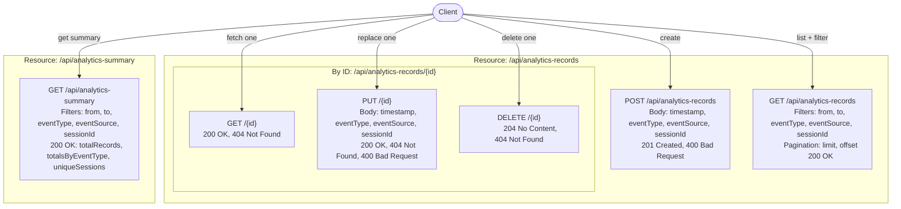
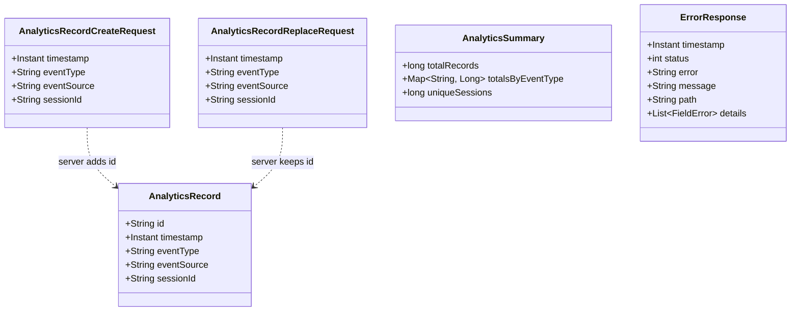
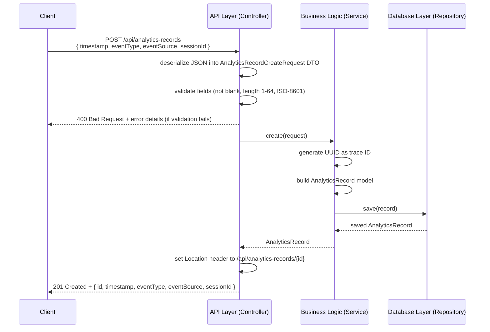
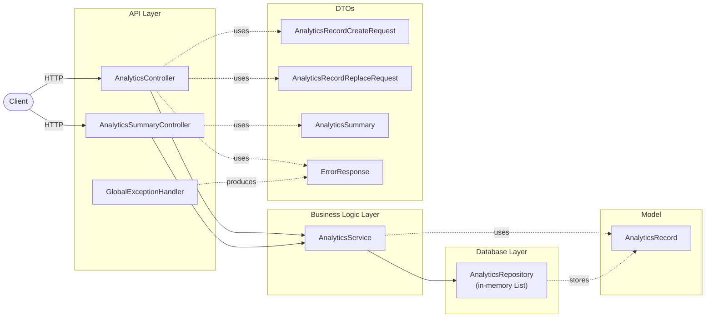

# API Design - Analytics API

## Base URL

`/api`

## Endpoint overview



## Resource: analytics records

### Data model

AnalyticsRecord

```
{
  "id": "uuid",
  "timestamp": "2026-05-28T12:34:56Z",
  "eventType": "page_view",
  "eventSource": "web",
  "sessionId": "anon-123"
}
```

Notes:
- `id` is server-generated and acts as the trace ID.
- `timestamp` uses ISO-8601 in UTC (e.g., `2026-05-28T12:34:56Z`).
- `sessionId` must be anonymized. No personal data is allowed.



## Endpoints

### Create record

`POST /api/analytics-records`

Request body (AnalyticsRecordCreateRequest)

```
{
  "timestamp": "2026-05-28T12:34:56Z",
  "eventType": "page_view",
  "eventSource": "web",
  "sessionId": "anon-123"
}
```

Validation rules
- `timestamp`: required, valid ISO-8601.
- `eventType`: required, non-blank, length 1-64.
- `eventSource`: required, non-blank, length 1-64.
- `sessionId`: required, non-blank, length 1-64.

Response
- `201 Created` with the created record.
- `Location` header points to `/api/analytics-records/{id}`.



### List records (with filters)

`GET /api/analytics-records`

Query parameters (all optional)
- `from`: ISO-8601 start time, inclusive.
- `to`: ISO-8601 end time, inclusive.
- `eventType`: filter by event type.
- `eventSource`: filter by event source.
- `sessionId`: filter by anonymized session ID.
- `limit`: default 100.
- `offset`: default 0.

Behavior
- Filters are combined with AND.
- If only `from` is provided, return records on or after `from`.
- If only `to` is provided, return records on or before `to`.
- If both are provided and `from` is after `to`, an empty list is returned.
- Results are sorted by `timestamp` descending.

Response
- `200 OK` with a JSON array of records.

### Get record by ID

`GET /api/analytics-records/{id}`

Response
- `200 OK` with the record.
- `404 Not Found` if the ID does not exist.

### Replace record by ID

`PUT /api/analytics-records/{id}`

Request body (AnalyticsRecordReplaceRequest)

```
{
  "timestamp": "2026-05-28T12:34:56Z",
  "eventType": "page_view",
  "eventSource": "web",
  "sessionId": "anon-123"
}
```

Validation rules
- Same as create.
- Full replace: all fields are required.

Response
- `200 OK` with the updated record.
- `404 Not Found` if the ID does not exist.

### Delete record by ID

`DELETE /api/analytics-records/{id}`

Response
- `204 No Content` if deleted.
- `404 Not Found` if the ID does not exist.

### Summary

`GET /api/analytics-summary`

Query parameters (optional, same as list)
- `from`, `to`, `eventType`, `eventSource`, `sessionId`

Response body

```
{
  "totalRecords": 123,
  "totalsByEventType": {
    "page_view": 100,
    "signup": 23
  },
  "uniqueSessions": 17
}
```

Response
- `200 OK` with the summary of records that match the filters.

## Error responses

All error responses use the following shape:

```
{
  "timestamp": "2026-05-28T12:34:56Z",
  "status": 400,
  "error": "Bad Request",
  "message": "Validation failed",
  "path": "/api/analytics-records",
  "details": [
    { "field": "eventType", "message": "must not be blank" }
  ]
}
```

Common errors
- `400 Bad Request` for validation failures (missing or blank required fields, invalid JSON).
- `404 Not Found` when a record ID does not exist.

## Architecture


